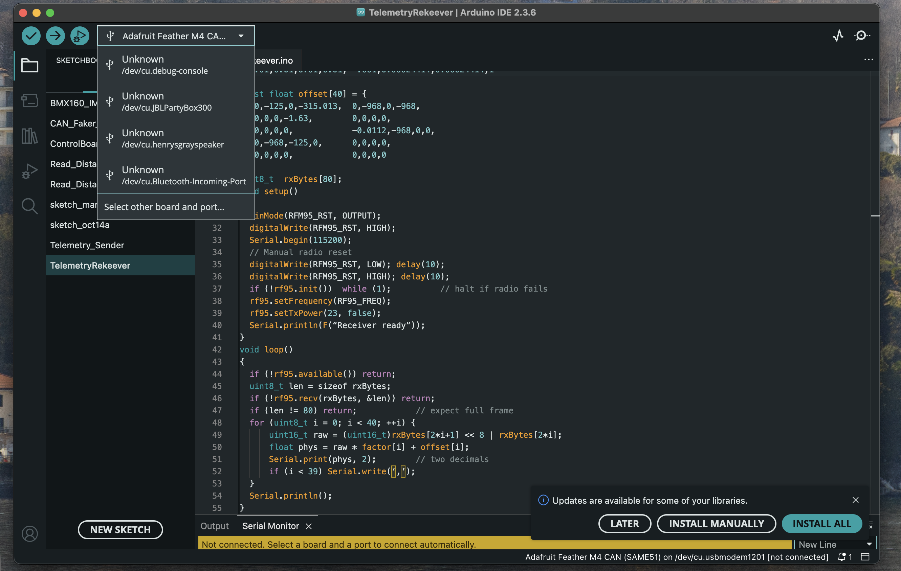

# WashU Racing Telemetry System
Welcome to the WashU Racing live telemetry website. 
Inside you'll find the different telemetry views, as well as the graphs within them.
While the commands in this guide are based on the macOS terminal, telemetry works with Windows, Mac, and Linux.


## Live Telemetry - Quick Start Guide
*WashU Racing's publicly-available Live Telemetry system lets our team view the most important on-car data points in real time.*<br><br>

### How to Set Up Live Telemetry Streaming
Live Telemetry uses a **publisher-subscriber** (pub-sub) system to allow multiple people to view the same data points at the same time. This section goes over how to set up the "publisher" computer to stream our telemetry to the web. **Note: the publisher *has* to be set up before anyone can view live telemetry.**

**What you'll need:**
- Computer with radio receiver
- Python 3.11 or higher installed
- Proximity (within 2 miles or so) to the racecar
- A decent internet connection
- VS Code (or other Python-capable IDE)
- The .env file for the backend (If you're attempting to set up the publisher, inshallah you have this)

<br><br>

First, ensure that the RF receiver is plugged in and running. The publisher app terminates without a valid serial connection.

Next, find out the name of the serial port that the receiver is connected to. There are many different terminal commands to accomplish this, depending on your OS.

<b>Mac/Linux</b>
```sh
ls /dev/tty.*
```

<b>Windows</b>
```sh
wmic path Win32_SerialPort get caption, deviceID
```

Additionally, Arduino IDE will tell you your serial port name (usually /dev/ttyXXXXX). Just remember to close Arduno IDE before running, as the receiver can only be read by one application at a time.



Open the GetDataFromCar.py file and ensure that the **PORT** variable on line 23 matches the serial device name you received in the previous step. If you got the serial port name from Arduino IDE, ensure to replace the *cu* in the device name with *tty*. A mismatched device name is one of the most common issues in getting the publisher to run.


Now that our code has been verified, in your terminal, run:
```sh
cd .../telemetry/TelemetryWebApp/telemetryBackend
pip install -r requirements.txt
python GetDataFromCar.py
```

Congrats! Telemetry should now be running on your local computer. Now, anyone can navigate to telemetry.washuracing.com and hit "Begin Streaming Session".

Note: For live data transfer, ensure that Backend.py is running on the server. Without it, data gets uploaded but can't be seen by anyone else. When analyzing old data, this isn't necessary, but is still best practice.

## Analyzing Old Data
This site also allows you to analyze old .csv files from Race Studio 3. After creating a .csv file in Box, upload the complete file _without being in an active viewing session_. The graphs should then populate with all of the valid data from that previous session.


## Standards

- All code should follow the [Google style guide](https://google.github.io/styleguide/)
- Repository should follow gitflow branching strategy
- More info can be found [here](https://docs.google.com/document/d/1ARGR6GPORXKE09iwE0viAhfVXgTAP3NhcMlSWubIhwk/edit?usp=sharing)
